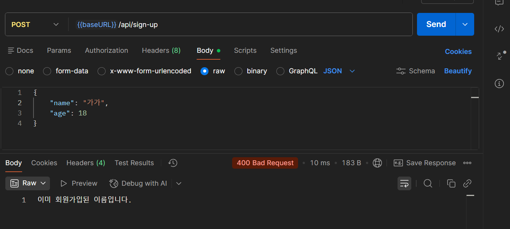
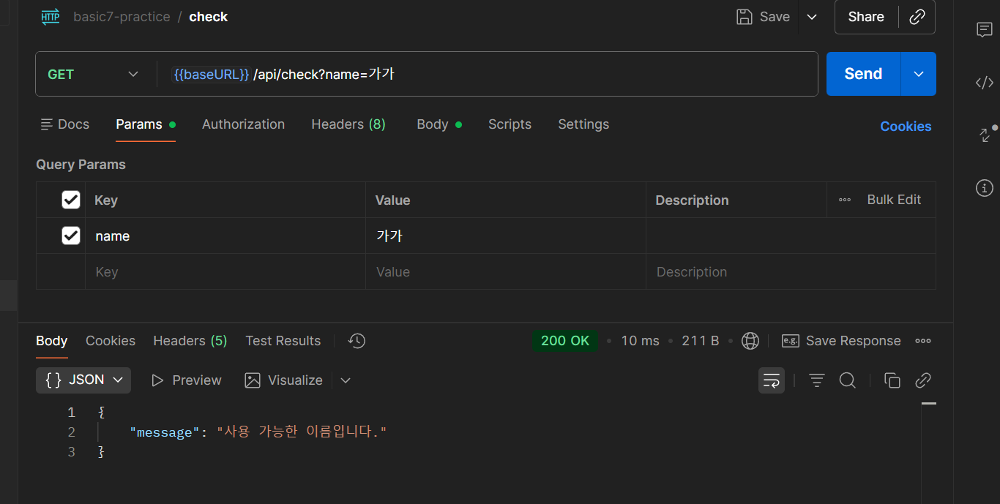
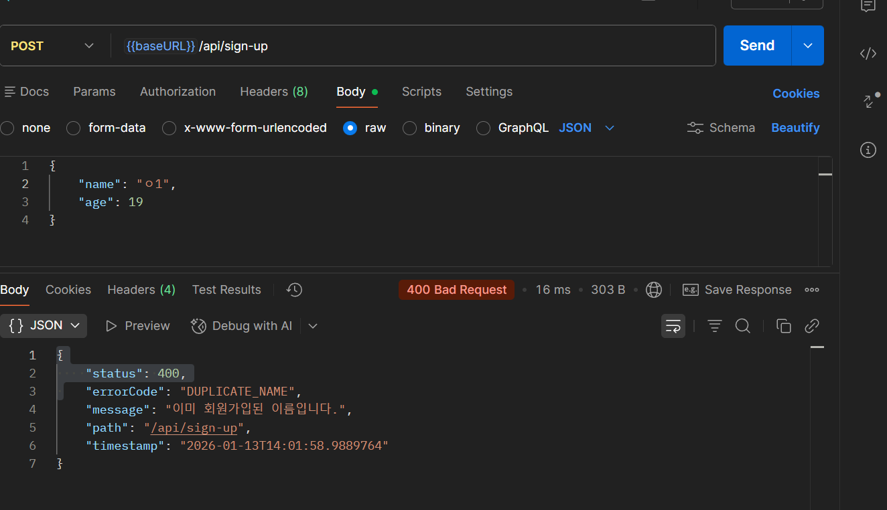
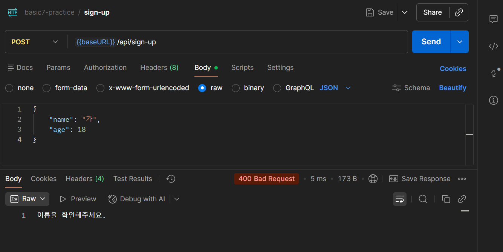
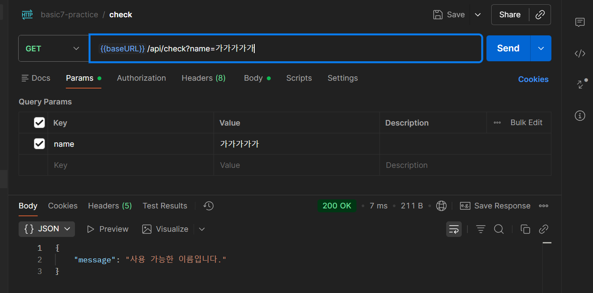
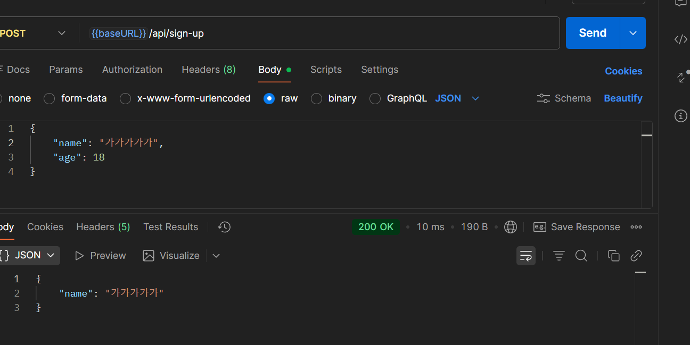
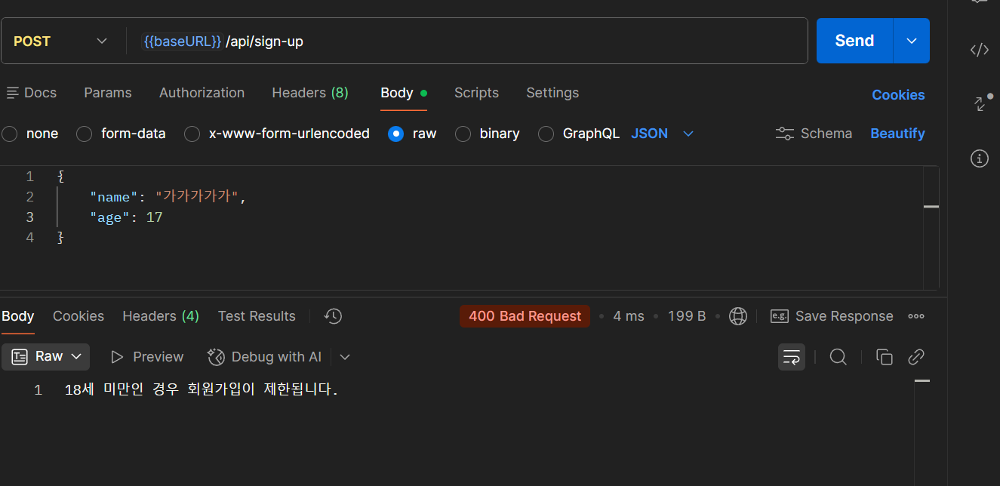
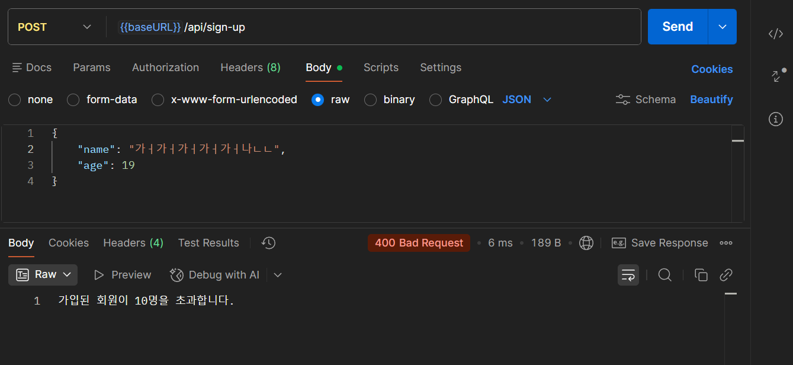

# 스탠다드반 과제 1

- 회원가입 기능 (POST "/api/sign-up") → `@RequestBody` 활용
    - 이름이 비어 있거나 2글자 미만일 경우 정상적인 회원가입이 되지 않아야 함 -> 완료
    - 나이가 18세 미만인 경우 회원가입이 제한되어야 함 -> 완료
    - 가입된 회원이 10명을 초과할 경우 회원가입이 제한되어야 함 -> 완료
- 사용자의 이름을 통해 이미 동일한 이름으로 회원가입되어 있는지를 확인할 수 있다 (GET "/api/check") → `@RequestParam` 활용 -> 완료
    - 동일한 이름이 존재하면: "이미 회원가입된 이름입니다." 반환 -> 완료
    - 동일한 이름이 존재하지 않으면: "사용 가능한 이름입니다." 반환 -> 완료
    - 이름이 비어 있거나 2글자 미만일 경우: 예외 발생 -> 완료

## 포스트맨 캡쳐
- 로그인 가능(sign-up, check)

- 같은 이름으로 회원가입한 사람이 있는 경우(sign-up, check)

- 이름 제한(빈칸, 1글자)

- 나이 제한(18세미만)

- 회원 초과
